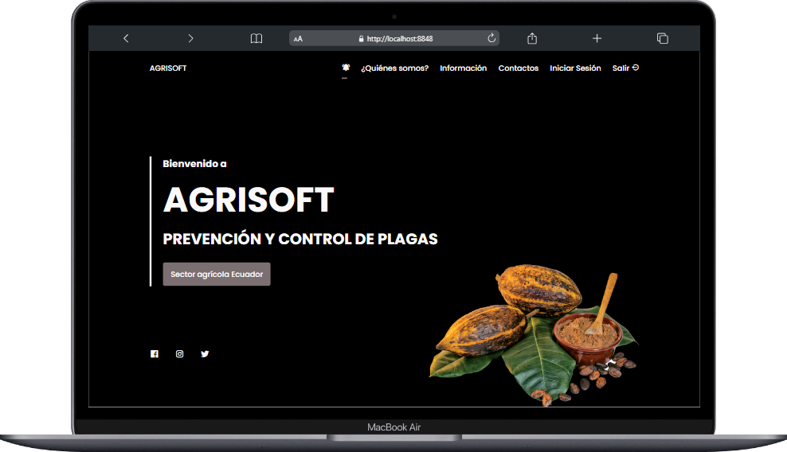

# AGRISOFT - Plagas en Cultivos

**AGRISOFT** es una plataforma integral que ayuda a los agricultores a identificar plagas en sus cultivos, proporcionando información detallada sobre cómo combatirlas y un formulario para reportar nuevas plagas.

## Tabla de Contenidos

- [AGRISOFT - Plagas en Cultivos](#agrisoft---plagas-en-cultivos)
  - [Tabla de Contenidos](#tabla-de-contenidos)
  - [Descripción](#descripción)
  - [Demo en Vivo](#demo-en-vivo)
  - [Capturas de Pantalla](#capturas-de-pantalla)
  - [Tecnologías Utilizadas](#tecnologías-utilizadas)
  - [Instalación](#instalación)
  - [Contribución](#contribución)

## Descripción

**AGRISOFT** es una herramienta vital para agricultores y agrónomos. Permite identificar plagas comunes en los cultivos, ofrece soluciones para combatirlas y brinda la posibilidad de reportar nuevas plagas, contribuyendo al control y la prevención.

## Demo en Vivo

Visita nuestro demo en vivo [Demo en Vivo](https://tu-demo-en-vivo.com)

## Capturas de Pantalla

<p align="center">
  
</p>

## Tecnologías Utilizadas

- HTML
- CSS
- JavaScript

## Instalación

Para usar **AGRISOFT** en tu propio entorno, sigue estos pasos:

1. Clona este repositorio en tu máquina local:

   ```bash
   git clone https://github.com/KevinRivera1/AGRISOFT-V1.git
    ```

2. Abre el proyecto en tu editor de código favorito.
3. Abre el archivo `index.html` en tu navegador.
4. ¡Disfruta! 🎉

## Contribución

¡Te invitamos a contribuir a nuestro proyecto! Si deseas colaborar, por favor sigue estos pasos:

1. Fork este repositorio.
2. Crea una rama (branch) con un nombre descriptivo.
3. Realiza tus cambios y mejoras en la nueva rama.
4. Abre una solicitud de extracción (pull request) para que revisemos tus contribuciones.